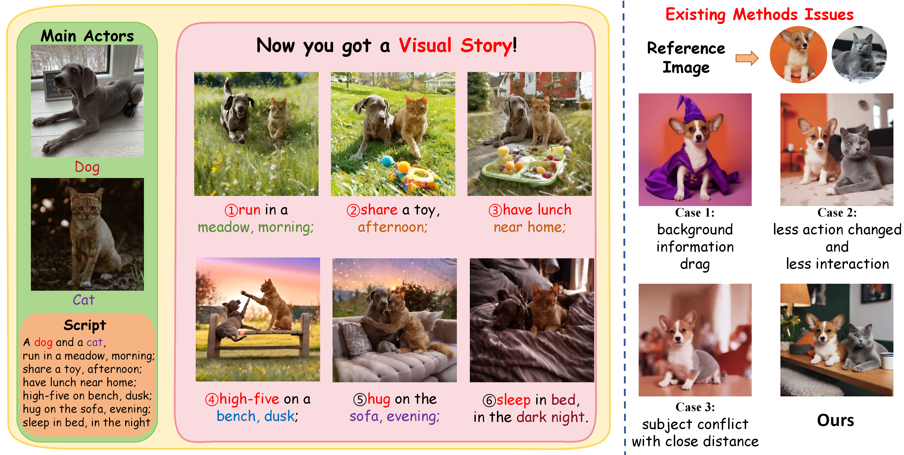
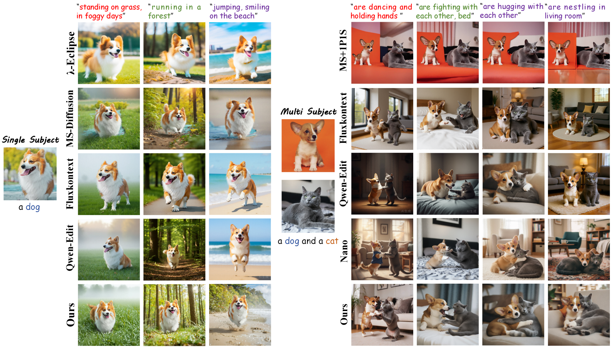
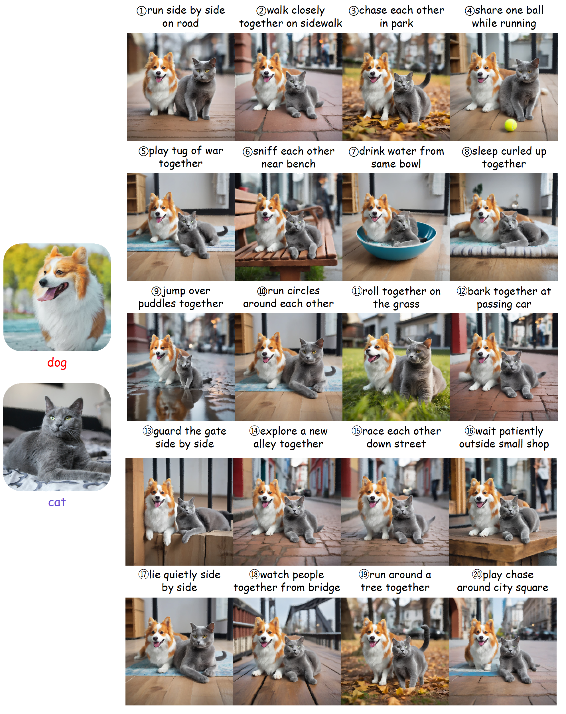

<h1 align="center">
  CVPR 2026 StoryTailor:A Zero-Shot Pipeline for Action-Rich Multi-Subject Visual Narratives
  <br>
</h1>


<div align="center">


<a href="https://arxiv.org/abs/2602.21273" style="display: inline-block;">
    
</a>&nbsp;
<a href="https://jinghaos-research.github.io/StoryTailor.io/" style="display: inline-block;">
    
</a>&nbsp;

</div>


<p align="center">
  <a href="#key-features">Key Features</a> •
  <a href="#Getting Started">Getting Started</a> •
  <a href="#license">License</a> •
  <a href="#citation">Citation</a> •
  <a href="#visualization">Visualization</a> 
</p>


## Main Contributions

* A zero-shot pipeline for action-rich multi-subject visual narratives
* GCA:
* AB-SVR:
* SFC:


## Getting Started

## Getting Started

### Setup

```bash
git clone git@github.com:Jinghaos-Research/StoryTailor.git
cd StoryTailor
pip install -r requirements.txt
```

### Model

Download the pretrained base models from [SDXL-base-1.0](https://huggingface.co/stabilityai/stable-diffusion-xl-base-1.0) and [CLIP-G](https://huggingface.co/laion/CLIP-ViT-bigG-14-laion2B-39B-b160k) and ms-adapter checkpoint from [MS-Diffusion](https://huggingface.co/doge1516/MS-Diffusion).

### Inference

```bash
python inference_story.py
```

## License
This project is licensed under the MIT License - see the [LICENSE](LICENSE) file for details.


## Citation
If our work assists your research, feel free to give us a star ⭐ or cite us using:
```
@article{hu2026storytailor,
  title={StoryTailor: A Zero-Shot Pipeline for Action-Rich Multi-Subject Visual Narratives},
  author={Hu, Jinghao and Zhang, Yuhe and Geng, GuoHua and Li, Kang and Zhang, Han},
  journal={arXiv preprint arXiv:2602.21273},
  year={2026}
}
```

## Visualization

### Multi-Subject Personalized Story Generation
  <figure style="display: inline-block; margin: 20px; text-align: center; max-width: 700px;">
    
  </figure>

### Comparison with Other Models
  <figure style="display: inline-block; margin: 20px; text-align: center; max-width: 700px;">
    
  </figure>

### Long Story Image Generation
<div align="center">
  <figure style="display: inline-block; margin: 20px; text-align: center; max-width: 700px;">
    
  </figure>


